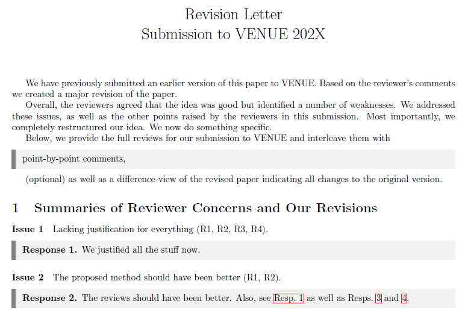
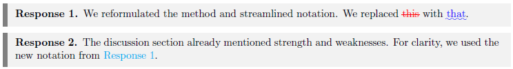
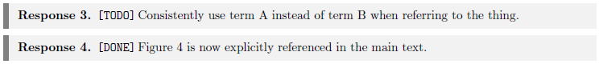

# Revision and Rebuttal Letter Template

This [Latex](https://www.latex-project.org/) template for paper revisions provides a clean structure for responding to reviewer comments. 
It is based on the ideas presented by Leilani Battle at the IEEE Vis 2020 [Fail Fest Workshop](https://virtual.ieeevis.org/year/2020/session_w-failfest.html) ([failfest.github.io](https://failfest.github.io/)).
<!-- 
Original link to the Paper Submission Revision Template (access is not possible): https://docs.google.com/document/d/1Vef5VaW1j_vtg5z9lWJo4aKgzM0hUe3UnfBdY6-_1DM/edit
Archive link for the Paper Submission Revision Template: https://web.archive.org/web/20210216160619/https://docs.google.com/document/d/1Vef5VaW1j_vtg5z9lWJo4aKgzM0hUe3UnfBdY6-_1DM/edit 
-->

## Usage
Interleave reviewer comments with
``` latex
\begin{response}
    point-by-point responses
\end{response}
```
that describe how you will tackle the raised concerns.
Ideally, phrase your responses in a past tense.
This way, you might be able to more easily re-use your responses when writing a final response letter.

Additionally, it can be helpful to first summarize each review in your own words and then outline main and recurring concerns, critiques and suggestions.


## Example
Have a look at the [example PDF](example/Revision_Rebuttal_Letter_Template.pdf) or view this project [in Overleaf](https://www.overleaf.com/read/wxwnzwjycrpd#c1c24c).



You can reference responses by labelling just as any other latex environment:

```latex
\begin{response} \label{res:method}
    We reformulated the method and streamlined notation. We replaced \highlightDeletion{this} with \highlightAddition{that}.
\end{response}

\begin{response} \label{res:clarify}
    The discussion section already mentioned strength and weaknesses. For clarity, we used the new notation from \autoref{res:method}.
\end{response}
```



To keep an overview of the revision progress, prefixing reposes with the current work status can come in handy:

```latex
\begin{response}
    \TODO Consistently use term A instead of term B when referring to the thing.
\end{response}

\begin{response}
    \DONE Figure 4 is now explicitly referenced in the main text.
\end{response}
```



## Sections

The template starts out with four sections, but of course you may use any subset in your response letter: 

1. Summaries of Reviewer Concerns and Our Revisions
2. Summaries of Individual Reviews
3. Full Reviews and Point-by-Point Responses
4. A comparison view of the original submission and current revision, created with [latexdiff](https://github.com/ftilmann/latexdiff/) (check the [ctan package](https://ctan.org/pkg/latexdiff) or [Overleaf's docs](https://www.overleaf.com/learn/latex/Articles/Using_Latexdiff_For_Marking_Changes_To_Tex_Documents) for more info)
   - The `\highlightDeletion` with `\highlightAddition` commands as exemplified above indicate additions and deletions like the latexdiff package
